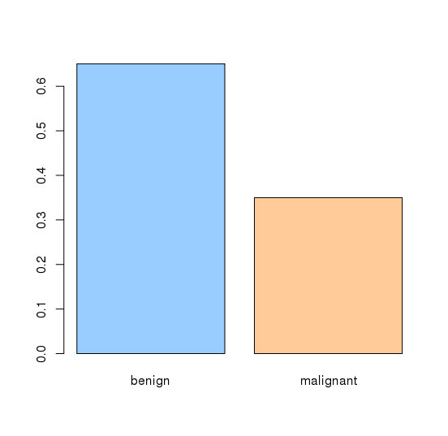
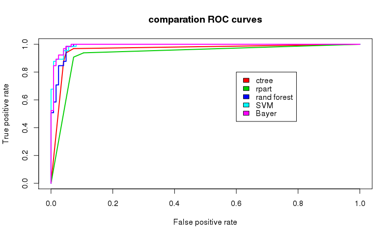

# BreastCancerCaseStudy

## Task 

The task of this project is to make a case study of the different classifiers and techniques used in datamining and machine learning and the advantages and disadvantages of each one of them. In order to do that we will using a Breast Cancer Dataset. After the case study we will be able to distinguish the best technique to create a classifier for this data for distinguish between malign and benign tumours. 

Description of the Data base 

For this project I chose the Breast Cancer Wisconsin (Original) Data Set: https://archive.ics.uci.edu/ml/datasets/breast+cancer+wisconsin+%28original%29 

This breast cancer databases was obtained from the University of Wisconsin, Hospitals, Madison from Dr. William H. Wolberg. Features are computed from a digitized image of a fine needle aspirate (FNA) of a breast mass. They describe characteristics of the cell nuclei present in the image.  

This dataset is formed by 11 attributes. Attributes from 2 to10 have been used to represent instances. Each instance has one of 2 possible classes:  benign or malignant. 

 
 
|  Field | Values  |
|--------|---------|
|1. Sample code number  |       id number  |
|2. Clump Thickness|                1 - 10  |
|3. Uniformity of Cell Size|        1 - 10  | 
|4. Uniformity of Cell Shape|       1 - 10  |
|5. Marginal Adhesion|              1 - 10  |
|6. Single Epithelial Cell Size|    1 - 10  |
|7. Bare Nuclei|                    1 - 10  |
|8. Bland Chromatin|                1 - 10  |
|9. Normal Nucleoli|                1 - 10  |
|10. Mitoses|                       1 - 10  |
|11. Class|                   benign or malignant |

 

In this dataset we have this class distribution: 

Benign: 458 (65.5%) 
Malignant: 241 (34.5%) 

## Data preparation and spliting 

Missing values are typical in  the Dataset, there are some methods to solve this problems such as eliminating or try to replace the missing values with the average value .In this dataset we have 16 missing values and we will used the “mice” library in order to complete he missing values with the most suitable ones. 

We use the factor function to convert the class attribute into categorical. Also, the ID column in the dataset is removed, because will not be useful for the creation of the classifiers. Also, we use a pre-processing in order to improve the outcome of the different classifiers. 

Splitting the data is one of the most important steps and concepts in Machine Learning. we need to split the dataset into training set and testing set. 

*TRAINING SET:*  is used to build and train the model. In classification problems such as this, we use the training data set to help us understand the data, select the appropriate model and determine model parameters. 

*TESTING SET:* this is the data used to check the model previously created from the training set. With this set we will be able to see the confusion matrix of the predicted values and generate ROC curse to measure the performance of the different classifiers. 

For this case study we will separate the data into 75% training set and 25% testing set. Also we need to make sure that both sets contains data that belong to both class. 

## Comparation of the results 
As we can see in the graph below all the classifiers did a good job classifying the testing set but as we can see in the graph below the Support vector machine and Naïve Bayes classifier made a very similar ROC curve. But we can see that Naïve bayer classifier has slightly more area under the curve. 

If we compare the accuracy of every classifier, we can see how Naïve Bayes has greatest value with 96,28. 

| Model      |  Accuracy |
|------------|-----------|
| Naïve Byes | 96,28 |
| Random forest | 96,27|
| svm      |  94.68 |
| Ctrees   | 96,28 |
|  rpart   |  92,02 |

 

 
 

## Conclusion: 

With this case study we learned how to use different classifying techniques in order to predict maling toumours. All of the classifiers had a good result averaging and accuracy oarround 92%. But we discovered that for this dataset the best classifier was the Naïve Bayes classifier. 

